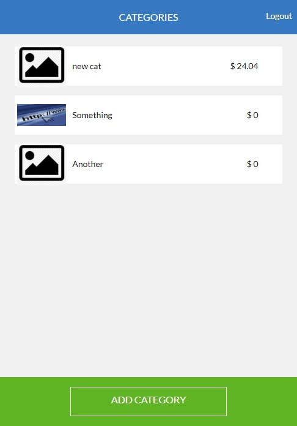
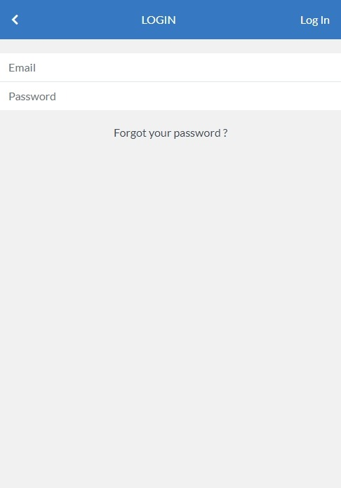
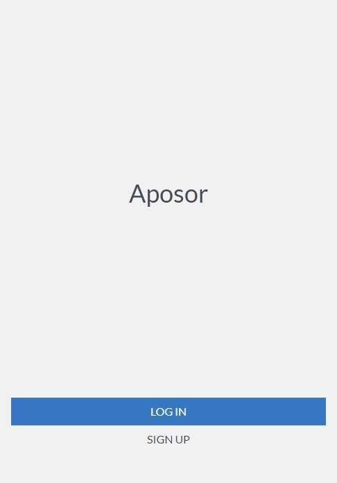

# budget_app
> Is about building a mobile web application where you can manage your budget: you have a list of transactions associated with a category, so that you can see how much money you spent and on what.

## Built with
- Ruby
- Ruby on Rails
- Tailwind css

## Demo
[Live](https://shrouded-garden-02833.herokuapp.com/categories)
[Presentation](https://www.loom.com/share/cdb3802b5ad34ea490e9e18dd1de60f0)

## Screenshots

## Pre-requisites
- Ruby
- Rails
- Node
- Git
- PostgreSQl

## Getting Started

Go to your terminal, navigate to your working directory and run

`git clone https://github.com/RayhanTabase/budget_app.git`

After that navigate to the newly created folder

`cd budget_app`

You now have access to the files.
To install necessary dependencies run

 `bundle install`

Configure PostgreSQL username and password in config folder -> database.yml
Or in config folder -> application.yml provide postgreSQL password in variable  my_postgres_password: 'Password goes here'

Start a local server running the command

`rails s`

## Author

👤 **Salim Abdulai**

- GitHub: [@RayhanTabase](https://github.com/RayhanTabase)
- Twitter: [@RayhanTabase](https://twitter.com/@RayhanTabase)
- LinkedIn: [Salim-Abdulai](https://linkedin.com/in/salim-abdulai-5430065b)
- Email: salimabdulai2@yahoo.com

## 🤝 Contributing

Contributions, issues, and feature requests are welcome!

Feel free to check the [issues page](../../issues/).

## Show your support

Give a ⭐️ if you like this project!

# Acknowledgement

- Hat tip to anyone whose code was a source of inspiration.
- A big thanks to [microverseinc](https://github.com/microverseinc).
- [Gregoire Vella](https://www.behance.net/gregoirevella) on Behance the author of the [original design](https://www.behance.net/gallery/19759151/Snapscan-iOs-design-and-branding?tracking_source=)

## 📝 License

This project is [MIT](./MIT.md) licensed.
